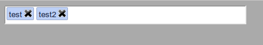

js-tagger
=========

Small pure javascript to transform a input field into a tag field

include the javascript:

    
    
have and input:

    <input id="my_tag_field" value="test, test2" />
    
Activate the plugin:

    
    
Now your your input should be a tag field with each tags in a box:

<exemple.png>

CSS given with this package should be rewriten to match your website style
